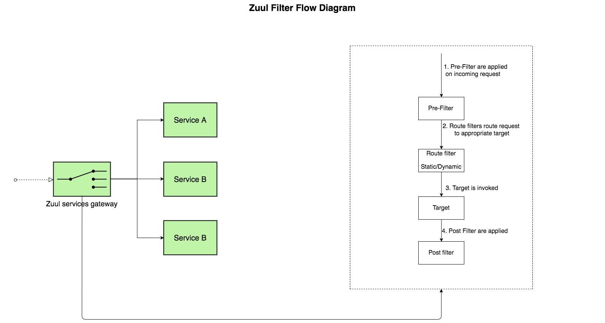

## Spring Cloud Example


### Up running with docker :

```
mvn clean install
mvn initialize docker:build
docker-compose -f docker-compose.yml up -d --build
```



#
### Links :

* ###### blogs:

    * [Zull How it works](https://github.com/Netflix/zuul/wiki/How-it-Works)

